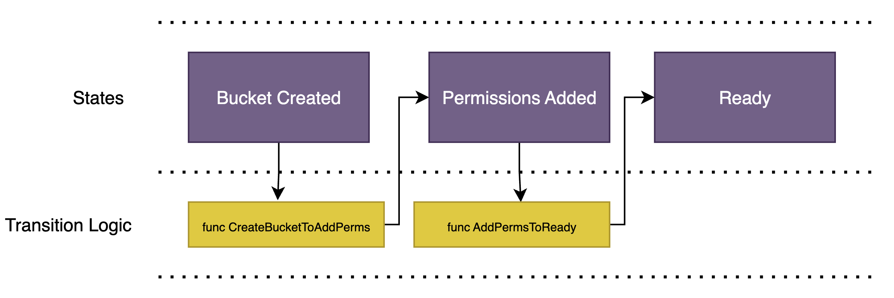

# Achilles SDK

The Achilles SDK offers efficient
[controller](https://kubernetes.io/docs/concepts/architecture/controller/) and
[operator](https://kubernetes.io/docs/concepts/extend-kubernetes/operator/)
creation by allowing engineers to focus on defining their automation business logic, modeled as transitions between resources states (i.e. an FSM). This
significantly lessens the knowledge of controller and Kubernetes plumbing
typically required to build controllers. It also forces standardization to
ensure consistency amongst controllers at Reddit, providing common functionality
such as metrics, logging, reusable API structs, etc..

As an example, assume you wanted to create a declarative API that allows
developers to request object storage for their application. The API you wish to
expose may look something like:

```yaml
apiVersion: infra.snooguts.net/v1alpha1
kind: ObjectStorage
metadata:
  name: persistent-storage
  namespace: web-apps
spec:
  encrypted: true
  region: us-east
  versioning: true
```

To define this API, you'll use a common-convention with Go structs to
automatically generate the
[CustomResourceDefinition](https://kubernetes.io/docs/concepts/extend-kubernetes/api-extension/custom-resources/#:~:text=The%20CustomResourceDefinition%20API%20resource%20allows,storage%20of%20your%20custom%20resource.)
(API). Then you'll define the states and transition logic, such as:



Along with doing the underlying plumbing to support this controller,
achilles-sdk is providing you logging, metrics, rate-limiting, and
more.

Lastly, in modeling your controller logic this way, you end up with a clean
directed graph that models a
[finite-state-machine](https://en.wikipedia.org/wiki/Finite-state_machine)
(FSM). This can significantly reduce the cognitive overhead of reasoning about
what a controller is doing or the state an object is in. More on FSM in the
documentation.

## Documentation

* [Creating a controller](https://pages.github.snooguts.net/reddit/achilles-docs/dev/sdk/tutorial/)
    * Comprehensive guide on the implementation of a controller with
      achilles-sdk.
* [Reconciler (FSM) Framework](docs/README.md)
    * Overview of how achilles-sdk works by offering a finite-state machine
      orchestrated with a Kubernetes reconciler.

## How to Contribute
1. Clone the repo locally.
2. Create a new branch
  - Make sure the branch is pushed to this repo, rather than from a fork. This allows us to easily test the branch code in our Tilt environment.
3. Make changes and test.
4. Submit a Pull Request with an appropriate description.
5. Merge PR once it is approved.

## Releasing
After incorporating your changes into the achilles-sdk repository, you can publish a new release to make the updated functionality available for repos that consume achilles-sdk such as [achilles](https://github.snooguts.net/reddit/achilles).

#### Publish a new release:
1. Navigate to the [GHE releases page for achilles-sdk](https://github.com/reddit/achilles-sdk/releases) and click the “Draft a new release” button in the top right
2. Choose the appropriate next semantic version (`major.minor.patch`):
   - If there are breaking code changes (e.g., new function signatures for public functions), increment the minor version if the release is pre-1.0, otherwise increment the major version
   - If there are no breaking changes, increment the patch version if pre-1.0, otherwise increment the minor version if adding functionality or the patch version if fixing bugs
   - To create a tag with the new version, click the “Choose a tag” button. Enter the new version number and click “Create new tag: `$your-tagname-here` on publish.”
3. Click the “Generate release notes” button and verify that the changes align with expectations. If everything looks good, publish the release

#### Make updated functionality available for repos like achilles:
1. Create a branch in the achilles repository
2. Run the following command to upgrade the achilles-sdk version (replace v0.7.1 with the new version number):  
   `go get github.com/reddit/achilles-sdk@v0.7.1`
3. Run a `git diff` and validate that the changes made to `go.mod` and `go.sum` are as expected. The diff should look something like the changes in this [PR](https://github.snooguts.net/reddit/achilles/pull/1135/files).
4. Create a PR in the achilles repo with the newly upgraded achilles-sdk version

<b>Note:</b> There are several other repos that also consume achilles-sdk but the current pattern is to allow consumers to update at their own leisure. The main repo that should for sure be updated to adopt the latest features is `reddit/achilles`.

## Questions

If you have any questions, please reach out to the `#achilles` Slack channel.
